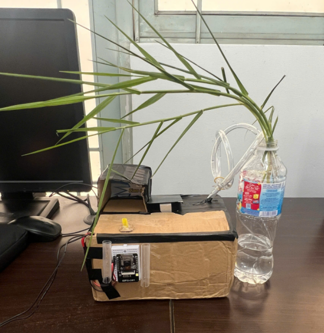
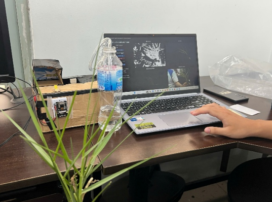
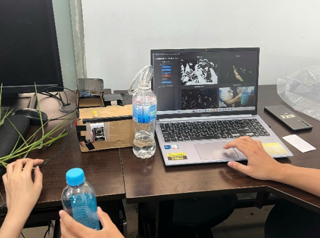
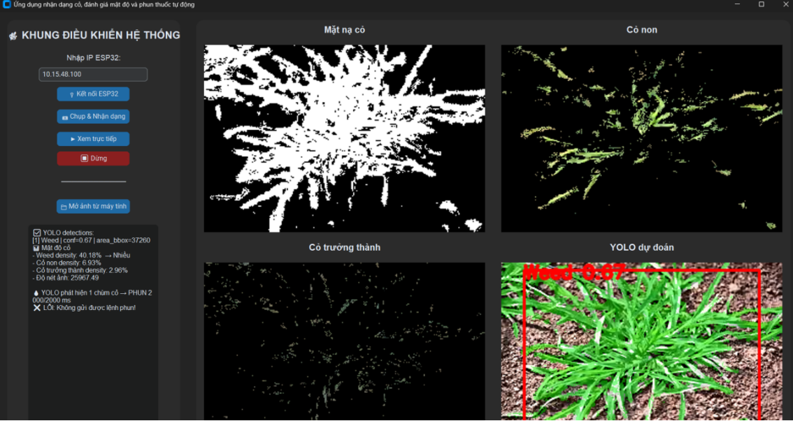

# 🌱 Weed Detection



## 📌 Giới thiệu

Dự án **Weed Detection** là hệ thống phát hiện cỏ dại trong nông nghiệp thông minh, sử dụng **thiết bị IoT** kết hợp **ứng dụng Python** và **mô hình YOLO** để nhận dạng cỏ dại từ hình ảnh.

Mục tiêu chính là hỗ trợ nông dân phát hiện cỏ dại nhanh chóng, giảm công sức thủ công và nâng cao hiệu quả canh tác.

---

## 🎯 Chức năng chính

* 📷 Thu thập hình ảnh từ camera IoT (ESP32-CAM)
* 🤖 Nhận dạng cỏ dại bằng mô hình **YOLO**
* 🌐 Gửi và xử lý dữ liệu bằng ứng dụng **Python**
* 📊 Hiển thị kết quả nhận dạng
* 🔔 Cảnh báo khi phát hiện cỏ dại

---

## 🛠️ Công nghệ sử dụng

* **Phần cứng:** ESP32-CAM và WiFi
* **Phần mềm:** Python 3.x, OpenCV, TensorFlow/Keras, NumPy
* **Mô hình AI:** YOLO

---

## 🧠 Mô hình YOLO

* Nhận đầu vào là hình ảnh từ camera
* CNN tự động trích xuất đặc trưng
* Phân loại ảnh: **Cỏ dại / Không phải cỏ dại**

---

## 🚀 Cách chạy chương trình

```bash
git clone https://github.com/Lvhai2k5/WeedDetection.git
python WeedDetection.py
```

---

## 📂 Cấu trúc thư mục

```
/
│-- WeedDetection.py        # Chương trình chính
│-- model.py                # Mô hình CNN
|-- sketch_dec4a.ino        # Chương trình IoT
│-- README.md
```

---

## 📈 Kết quả

* Nhận dạng được cỏ dại từ hình ảnh
* Hệ thống hoạt động ổn định trên nền tảng IoT



---

## 🔮 Hướng phát triển

* Tăng độ chính xác mô hình YOLO
* Tích hợp phun thuốc tự động

---

## 👨‍💻 Tác giả

* **Lê Vũ Hải**
* **Lê Thị Thảo**
* **Huỳnh Hoài Phương**
* **Vũ Minh Khang**

---

✨ *Weed Detection using IoT & Python with YOLO - MONG MUỐN NHẬN ĐƯỢC SỰ ĐÓNG GÓP TỪ MỌI NGƯỜI (lehai332k5@gmail.com)*


